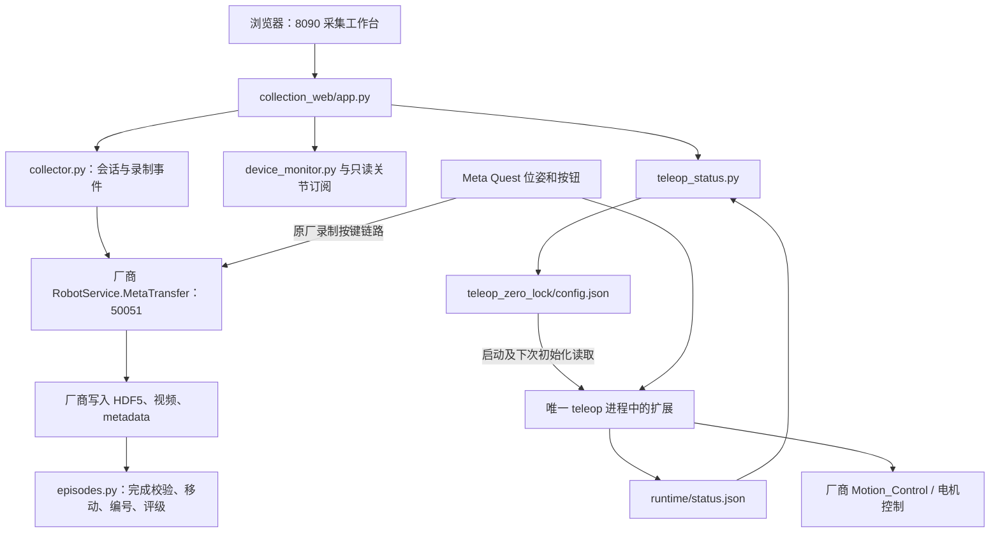

# ZERITH 独立数据采集系统 1.0：网站、头腰锁零与固定升降柱

本分支 `data_collection_new` 从 `datacollection` 的 `3fd15d26500e3130eb5dfda875fb4201eedd7979` 创建，整理了 2026-09-08 在本机开发、部署和测试的数据采集完整版本。

本机网站地址：**http://172.16.18.43:8090**。默认监听 `0.0.0.0:8090`，同一网络可访问。网站部署目录为 `/home/robot/collection_web`，遥操扩展为 `/home/robot/teleop_zero_lock`，二者不依赖 `/home/robot/control` 或 8080 网站。

本次解决的三个主要问题：

1. 头腰保持零目标，角度小偏差仅预警，不再自动暂停遥操作或取消录制。
2. 标定成功后，在网页明确提示下一步，并可开启浏览器语音提示。
3. 升降柱支持指定高度初始化并保持，默认固定 **0.4 m**；X 锁定/解锁和 VR 身体高度变化不能覆盖固定目标。

本机已完成新版本短录制验证：**999 帧 / 33.38 秒 / 29.90 Hz**，四个头腰关节目标全程为 0，最大实际角度偏差 **0.01431 rad**；升降柱保持 0.4 m，最大误差约 **0.000033 m**。适用范围、采样间隔与未测试项见下文，不能把这次短测解释为所有高度和所有场景均已长期验证。

## 1. 文档导航与版本范围

| 文档 | 内容 |
| --- | --- |
| 本 README | 本分支完整功能、改动位置、实现原理、使用与验收说明 |
| [collection_web/README.md](collection_web/README.md) | 网站部署、任务配置、目录命名与采集操作 |
| [teleop_zero_lock/README.md](teleop_zero_lock/README.md) | 遥操扩展构建、自检、切换、监测和回退 |
| [collection_web/TEST_REPORT.md](collection_web/TEST_REPORT.md) | 网站历史验收与 1.0 联调结果 |
| [teleop_zero_lock/TEST_REPORT.md](teleop_zero_lock/TEST_REPORT.md) | 头腰与升降柱试验过程、失败修复、最终真机数据 |
| [docs/data_collection_release_1.0.json](docs/data_collection_release_1.0.json) | 厂商/部署二进制哈希、版本和验证信息 |
| [CONTROL_README.md](CONTROL_README.md) | 原根 README：数值控制、状态读取、语音等原有项目说明 |
| [CORE_GUIDE.md](CORE_GUIDE.md) | 原有整套机器人控制工具的快速入口 |

仓库原有 `web_control/`、`voice_assistant/`、`chinese_speech/` 等项目保留。本次改动集中于 `collection_web/`、新增的 `teleop_zero_lock/` 和说明文档，不把它们合并为一个机器人控制进程。

### 1.1 相对 datacollection 分支具体增加了什么

| 类别 | 本次变化 | 主要文件 |
| --- | --- | --- |
| 遥操扩展 | 新增完整头腰锁零、升降柱固定、状态输出及原厂方法接入 | [patch/zero_lock.py](teleop_zero_lock/patch/zero_lock.py) |
| 独立构建 | 从本机厂商副本构建带扩展的独立可执行文件 | [archive.py](teleop_zero_lock/tools/archive.py)、[build_trial.py](teleop_zero_lock/tools/build_trial.py)、[bootstrap.py](teleop_zero_lock/tools/bootstrap.py) |
| 切换/恢复 | 单个 teleop 进程切换、候选版升级和恢复厂商版本 | [switch_trial.py](teleop_zero_lock/tools/switch_trial.py)、[upgrade_trial.py](teleop_zero_lock/tools/upgrade_trial.py)、[preflight.py](teleop_zero_lock/tools/preflight.py) |
| 网站状态接口 | 新增遥操状态文件读取和固定高度设置接口 | [teleop_status.py](collection_web/teleop_status.py)、[app.py](collection_web/app.py) |
| 网页交互 | 标定成功、遥操状态、偏差预警、浏览器语音、固定高度输入 | [index.html](collection_web/static/index.html)、[app.js](collection_web/static/app.js)、[style.css](collection_web/static/style.css) |
| 只读诊断 | 连续监测、总线采样、已完成 HDF5 核验 | [monitor_trial.py](teleop_zero_lock/tools/monitor_trial.py)、[joint_trace.cpp](teleop_zero_lock/tools/joint_trace.cpp)、[analyze_recording.py](teleop_zero_lock/tools/analyze_recording.py) |
| 测试 | 扩展策略、真实厂商模型/接口、网页状态与配置限制测试 | 两个项目的 `tests/` 目录 |

**采集会话、设备检测、目标商品解析、目录命名、顺序编号、A/B/F、放弃删除、相机预览和 rad 显示已在基线分支存在。** 本分支保留这些能力，并在下文统一说明其实现位置；不是把原有功能重复计为本次新开发。

## 2. 整体架构：网站封装现有采集服务，扩展作用于唯一遥操进程



- 原来 Apifox 的作用是持有 `MetaTransfer` 调用；网站现在通过自己的后端持有该 gRPC 流。相机数据同步、底层文件写入、录制按钮识别仍由厂商服务完成。
- 网站的启动采集按钮创建采集会话，**不等于初始化机器人，也不等于按下 Y 开始一条 episode**。
- 网站本身不通过 SDK 发布关节运动。它只把升降柱设置写入配置文件，供遥操进程在初始化时读取。
- 遥操扩展在同一个 teleop 进程内部接入模型和指令输出。没有额外启动第二个头腰/升降柱控制发布者来与 VR 抢控制权。
- 厂商安装目录、`robotd`、`Motion_Control`、`SDKService` 和采集 server 没有被替换。切换的是单独的 `robot_startup:teleop` 窗口。

## 3. 网站已有采集功能：做什么、在哪里实现

### 3.1 采集启动与结束

实现位置：[protocol.py](collection_web/protocol.py) 的 `Vendor.meta()`、`Vendor.devices()`；[collector.py](collection_web/collector.py) 的 `start()`、`_receive()`、`_watch()`、`end()`。

1. `tasks.validate_task()` 校验 Prompt、任务编号、阶段数、频率、时长和目标商品。
2. `Collector.preflight()` 汇总设备、存储空间、写权限和当前是否已有采集等检查。
3. `start()` 建立本次会话和 gRPC 流；请求仍使用原厂 `json_config` 字符串。
4. `_receive()` 记录原厂返回，接收 `EPISODE_START`、`EPISODE_PROGRESS`、`EPISODE_END`。
5. 等待首个录制事件期间，厂商不一定返回普通 ready 消息；网站通过任务 metadata 内容匹配确认配置已接受，不能仅因 RPC 已创建就显示成功。
6. `_watch()` 跟踪文件、录制进度和完成条件，更新网站显示。
7. `end()` 关闭本次网站持有的采集连接；当前 episode 未结束时拒绝直接结束会话。网页关闭并不等于后端会话关闭。

连接中断会记录状态和原因，不盲目重新提交相同任务。采集会话的状态与机器人遥操作状态分开显示。

### 3.2 设备检测与真实关节数值

实现位置：[device_monitor.py](collection_web/device_monitor.py) 的 `DeviceMonitor`；[joint_observer.cpp](collection_web/joint_observer.cpp) 的 `Observer`。

- gRPC 设备状态与厂商 HTTP `25120` 的电机、通信板、初始化、模式、电池信息分别读取。
- 检查 23 个电机报告、通信状态、VR 位姿字段、相机状态与机器人模式。
- `joint_observer.cpp` 只订阅 `waist_state`、`head_state`，保存实际反馈，不发布控制指令。
- 升降柱显示 **m**，腰 pitch/yaw、头 yaw/pitch 显示 **rad**。
- 网页顶部持续显示 `50051 已连接` 或连接异常。
- **VR 位姿已接入不等于遥操已启动**。详细“待标定/标定成功/遥操作中”来自本次新增的遥操状态接口。

### 3.3 Prompt、左右商品与数据目录

实现位置：[tasks.py](collection_web/tasks.py) 的 `parse_targets()`、`validate_task()`、`dataset_name()`；[collector.py](collection_web/collector.py) 的 `task_paths()`。

目标商品按类似 `Grasp ... with the left/right hand` 的英文句式用规则提取，支持手动修正。它不是通用大模型语义解析，任意措辞的提示词不保证自动识别。

填写任务区的“目录高度标签”后，归档目录可为：

```text
/data/zerith_data/DahongpaoMilkTea_Ifcoconut_0.8/
```

其中商品名称空格会整理，高度字符串会标准化。厂商仍写入原来的任务目录，完整 episode 保存后网站才搬移归档。**目录高度标签不会驱动升降柱；实际运动高度由新的“固定升降柱”设置决定。**

### 3.4 UUID 目录编号、评级与放弃

实现位置：[episodes.py](collection_web/episodes.py) 的 `EpisodeStore.observe()`、`finalize()`、`_finish_index()`、`rate()`、`delete()`、`recover()`。

- 只有确认厂商写入结束并完成结构检查，才移动目录并编号为 `episode_000001`、`episode_000002` 等。
- 正在写入的目录不重命名；已存在目录不覆盖；同名数据集继续递增编号。
- SQLite 索引和 `review.json` 保存编号、原 UUID、评级等。路径变更过程具有恢复处理。
- 保存完成默认评级 A，提供 A/B/F 修改和显式确认后的放弃删除。
- 重命名不伪造 HDF5 内原始 UUID、提示词、关节状态。跨目录归档时另存 `collection_task.json` 记录配置和来源。
- **默认 A / 结构检查通过不代表“头腰已锁零”或任务动作质量合格**，运动学核验是单独的诊断步骤。

### 3.5 相机预览与回看

实现位置：[cameras.py](collection_web/cameras.py) 的 `set_enabled()`、`_loop()`、`frame()`；[app.py](collection_web/app.py) 的相机/视频路由。

预览默认关闭，开启后通过厂商 `CameraClient` 读取头部、左腕、右腕图像，再向网页提供 JPEG。预览使用 RGB，厂商原始采集数据是否含 depth 沿用原采集配置。关闭预览会清理客户端资源。已保存数据可以从网站回看视频。

## 4. 头腰保持零位的实现

核心文件：[teleop_zero_lock/patch/zero_lock.py](teleop_zero_lock/patch/zero_lock.py)。

### 4.1 约束哪些轴

| 模型关节 | 含义 | 19 维配置下标 | 目标 |
| --- | --- | ---: | ---: |
| `body_pitch_joint` | 腰 pitch | 1 | 0 rad |
| `body_yaw_joint` | 腰 yaw | 2 | 0 rad |
| `neck_yaw_joint` | 头 yaw | 17 | 0 rad |
| `neck_pitch_joint` | 头 pitch | 18 | 0 rad |
| `daogui_joint` | 升降柱，可选固定 | 0 | 配置值，默认 0.4 m |

`project()` 拷贝配置并约束对应轴，不修改传入原数组；双臂 14 个关节保留。速度/加速度的固定轴投影为 0，不能把高度数值误当作速度。

### 4.2 为什么不只在最终输出时把角度改为零

若 IK 仍允许腰/头移动，却只在最后把指令裁成零，双臂规划所假设的机身姿态会与机器人实际不同。

`freeze_model()` 因而先冻结四个旋转轴的运动 twist，使 FK 和 Jacobian 与固定头腰一致；`move_to_cartesian()` 接入进一步保持求解结果约束。`GuardedBus.publish()` 最后再约束 `head_control` 和 `waist_control`，避免其他发送路径覆盖目标。

`install()` 包装 `ZerithWBC` 和 `ZerithCtrl` 的指定方法：

- VR 的 IK 模型参与约束。
- `ZerithCtrl` 内用于真实末端反馈的 WBC **保持原模型**，不能把实际非零头腰假装成零。
- 厂商另外构造的 16 轴 `HIGH_LEVEL` 模型不参与本扩展约束。
- 重新标定产生新的 dummy model 后重新施加约束，保留原模型副本，避免重复叠加。

### 4.3 头部静差与缓慢补偿

原厂测试曾出现“头 pitch 目标 0，实测约 0.074 rad”的静差，因此只改角度指令不足以达到用户希望的约 0.02 rad 范围。

`HeadGravity` 按 URDF 关节名称读取真实腰/头位置，使用 Pinocchio 计算头部分支重力。`ZeroPolicy.head_target()` 从实时头部反馈平滑归零；`head_feedforward()` 加入缓慢、受限的重力前馈与积分修正。

当前参数保持已测版本：

| 项目 | 值 |
| --- | --- |
| 头部初始归零曲线 | 五次曲线，最短 3 秒，最大设定速度 0.03 rad/s |
| KP / KD | 保留原厂参数，本轮实测为 `[6,6] / [1,1]` |
| 总前馈限制 | ±0.6 N·m |
| 前馈变化率 | 0.05 N·m/s |
| 积分修正限制 | ±0.15 N·m |
| 腰两轴、头 yaw 质量提示阈值 | 0.005 rad |
| 头 pitch 质量提示阈值 | 0.021 rad，包含约 0.02 rad 的采样余量 |

这里的“零位”指目标为零且反馈尽量接近零，不修改编码器零点、不改写反馈、不承诺数学意义上的绝对零误差。

## 5. 本次关键修改：偏差只预警，不暂停

实现位置：`ZeroPolicy.warnings()`、`ZeroPolicy.ready()`、`after_joystick()`。

早期试验版把位置稳定性 `ready()` 同时用作运行门槛。实测头 yaw 只有一帧达到 `-0.00514984 rad`，就触发了暂停；另一次头 pitch 约 `0.02117 rad` 也中断遥操。这不符合用户接受小偏差、连续录制的要求。

当前版本的行为：

- 角度偏差、头部归零等待、补偿尚在稳定中：生成状态/预警，**不因这些原因暂停双臂或拒绝 A 启动**。
- 固定升降柱与目标偏差超过 0.005 m：只生成高度偏差预警。
- `ready` 继续表示位置是否稳定，供操作者和诊断查看；它不再直接决定角度超差暂停。
- `after_joystick()` 仅在扩展反馈故障或未激活等故障条件下保留暂停处理；先执行原厂按钮逻辑和原厂安全处理。
- 操作者短按 A 仍然可以主动暂停/恢复；标定完成后仍停在等待用户启动的位置。
- 急停、电机错误、VR 数据丢失、通信/反馈过期等保护没有取消。**“只预警”针对位置质量偏差，不是关闭所有机器人保护。**

没有把厂商 Y 录制键改造成强制零位联锁。若归零、反初始化时自行开始录制，厂商仍可能保存这些过程；网页提示不等于阻止生成质量不合格数据。

## 6. 标定成功提示：状态如何传到网页

实现位置：

- 扩展 `install()` 中 `calibrated()` / `recalibrated()` 包装器；
- `after_joystick()`、`ZeroPolicy.write_status()`；
- 网站 [teleop_status.py](collection_web/teleop_status.py) 的 `snapshot()`；
- 前端 [app.js](collection_web/static/app.js) 的 `renderTeleop()`、`sayTeleop()`。

完成标定后递增 `calibration_seq`，记录明确日志，并输出 `operator.initialized`、`operator.calibrated`、`operator.state`。网页不再让使用者仅靠猜测等待秒数判断。

| 条件 | 页面显示 |
| --- | --- |
| 未初始化 | 未初始化 · 长按 A 初始化 |
| 原厂初始化中 | 正在初始化 |
| 已初始化但未标定 | 待标定 · 短按 A 标定 |
| 标定完成、等待启动或已主动暂停 | 标定成功 · 短按 A 启动遥操 |
| 连续遥操状态 | 遥操作中 |
| 反馈故障 | 反馈异常 · 请检查设备 |
| 状态文件过期/连接中断 | 状态中断或等待遥操状态 |

状态和预警分别显示。即便角度偏差预警出现，运行中的标题仍保持“遥操作中”，不会用预警文本掩盖真实运行状态。

点击“开启语音提示”后，当前浏览器可播报标定成功。这是浏览器 Web Speech API，不是机器人扬声器/Quest 内置语音；实际声音取决于浏览器语音引擎、用户操作和音频输出设备。没有开启声音时仍有醒目的页面状态与提示。

## 7. 固定升降柱：设置、初始化、保持三层实现

配置文件：[teleop_zero_lock/config.json](teleop_zero_lock/config.json)。

```json
{
  "lift_enabled": true,
  "lift_height_m": 0.4
}
```

### 7.1 配置入口

网页“固定升降柱”与“目标高度”通过 `POST /api/teleop/config` 写入配置。`TeleopStatus.save()` 校验 0–0.8 m、扩展状态、反初始化状态和无正在录制数据，再用临时文件与原子替换保存。

仅保存配置不产生运动。生效点是下一次初始化，不能在双臂运行期间改高度造成突然升降。高度是与 `waist_state.position_actual[0]` 相同定义的升降关节坐标，不是机器人总高度或商品离地高度。

### 7.2 初始化到目标

`install()` 的 `initialize()` 包装器在初始化前读取配置，把原厂 `vr_home_pose[0]` 换成目标高度，清除旧 X 锁定状态，再执行原厂 `init()` 和 `send_interpolated_cmd()`。

原厂平滑初始化完成前不启用最终固定输出，避免把每个插值点直接裁为终点。关闭固定后恢复保留的原厂 `vr_home_pose`，当前厂商默认初始化高度仍是 0.4 m。

### 7.3 模型保持同一个高度

`freeze_model(robot, lift_height)` 将升降柱指定平移折入该关节父变换，再把升降自由度的 twist 置零，仍保留厂商 19 维配置接口。这与仅把 lift 配置写成 0 的处理不同：锁定 0.4 m 时，模型的位置也必须位于 0.4 m。

`constrain_planner()`、`update_dummy()`、`move_to_cartesian()` 在初始化和重新标定后重新保持这个约束。重复标定使用原始模型副本，不会把高度重复加到模型上。

### 7.4 最终控制输出保持

`send_control()` 去除固定模式下的 VR 高度偏移，投影轨迹/速度/加速度，并更新腰部缓存；`GuardedBus.publish()` 最终固定：

```text
waist_control.position = [指定高度, 0, 0]
waist_control.speed    = [0, 0, 0]
```

双臂指令仍正常发送。X 锁定/解锁保留原厂按钮语义，但不能覆盖固定目标。反初始化后扩展撤销保持，升降柱随原厂反初始化流程变化；“初始化之后不动”不包括断电/反初始化后的主动保持。

## 8. 接口与单位速查

所有 POST 沿用网站 `X-Collection-Token` 校验及来源检查；令牌由 `/api/bootstrap` 获取，不写死在代码或文档里。

| 接口 | 用途 | 本次变化 |
| --- | --- | --- |
| `GET /api/bootstrap` | 页面令牌、默认 Prompt | 继承 |
| `GET /api/status` | 设备、采集、相机状态 | 新增 `teleop` 字段 |
| `POST /api/teleop/config` | 保存升降柱设置 | 新增 |
| `POST /api/task/parse` | 左右目标提取 | 继承 |
| `POST /api/task/directory` | 只读目录预览 | 继承 |
| `POST /api/preflight` | 采集启动检查 | 继承 |
| `POST /api/session/start` | 建立采集会话 | 继承 |
| `POST /api/session/end` | 结束会话 | 继承 |
| `POST /api/episode/rate` | A/B/F 评级 | 继承 |
| `POST /api/episode/delete` | 确认后删除本条数据 | 继承 |
| `POST /api/cameras` | 预览开关 | 继承 |

扩展 `runtime/status.json` 中主要字段：

| 字段 | 含义 |
| --- | --- |
| `active` | 锁零策略是否激活 |
| `ready` | 位置稳定性指示，不是新的运动许可开关 |
| `operator` | 初始化、标定和遥操状态 |
| `calibration_seq` | 每次标定成功递增，用于页面提示 |
| `actual_rad` | 腰 pitch、腰 yaw、头 yaw、头 pitch 的实际值 |
| `warnings` / `fault` | 质量偏差提示与反馈故障分别表示 |
| `lift_target_m` / `lift_actual_m` | 升降柱目标和实际值 |
| `config` | 当前进程实际应用的配置 |
| `deviation_policy` | 当前为 `warn_only` |
| `timestamp` | 文件状态更新时间 |

网站通常将超过 3 秒未更新的状态视为中断；原厂初始化存在阻塞过程，初始化期间允许到 15 秒。网站还分别返回待应用的 `config` 与进程的 `applied_config`，不能把“保存了新高度”误读为机器人已经移动。

## 9. 从源码部署：环境与路径

当前实现针对本机路径。仓库不包含厂商二进制、SDK、Python 虚拟环境、采集文件、日志、运行数据库或凭据。

| 依赖 | 本机使用位置/用途 |
| --- | --- |
| Python 3.10 | `/home/robot/miniconda3/envs/zerith/bin/python`，必须匹配厂商 Python 3.10 归档 |
| 网站 Python 依赖 | `collection_web/requirements.txt`：grpcio、protobuf、numpy、h5py、opencv-python |
| 相机 SDK | `/home/robot/H1_SDK_1.3.9/camera_sdk_python` |
| C++ ZCM 消息头 | `/home/robot/H1_SDK_1.3.9/robot_SDK/include/ZCM_Data` |
| C++ 编译依赖 | `g++`、`pkg-config`、可用的 ZCM 开发库 |
| 厂商采集服务 | gRPC 50051、HTTP 25120 |
| 厂商 teleop | 必须与下方 SHA256 完全一致的本机副本 |

将两个项目目录部署到 `/home/robot/collection_web` 和 `/home/robot/teleop_zero_lock`。不要在现有进程仍运行时直接覆盖可执行文件、运行数据库或厂商目录。

### 9.1 网站

首次准备环境可按本机既有 zerith 环境创建独立 venv：

```bash
cd /home/robot/collection_web
/home/robot/miniconda3/envs/zerith/bin/python -m venv --system-site-packages .venv
.venv/bin/python -c "import grpc, google.protobuf, h5py, numpy, cv2"
```

若缺少依赖，再按 requirements 安装。`start.sh` 会按需编译只读关节订阅程序：

```bash
./start.sh --host 0.0.0.0 --port 8090
```

已有用户服务时用 `systemctl --user status zerith-collection-web.service` 检查。首次安装服务的模板在 [collection_web/deploy/zerith-collection-web.service](collection_web/deploy/zerith-collection-web.service)。不要同时启动手动网站与同端口服务。

### 9.2 厂商副本与构建

在 `/home/robot/teleop_zero_lock/vendor/teleop.original` 放置本机厂商副本，必须匹配：

```text
3c807604a116128c27bcf0ca52310a4102e436c1a277af1c0301b1ef452f7282
```

`Archive.build()` 仅替换 PyInstaller 的 teleop 入口，另外 **643 个归档条目**逐字节保留，并保留归档后附加数据。`build_trial.py` 固定检查厂商版本，生成构建清单。不同厂商版本不能绕过哈希检查直接使用。

首次部署、目标文件尚未运行时：

```bash
cd /home/robot/teleop_zero_lock
mkdir -p runtime vendor
/home/robot/miniconda3/envs/zerith/bin/python tools/build_trial.py --output runtime/teleop_zero_lock
./runtime/teleop_zero_lock --offline-self-test
```

离线入口首先封禁真实 ZCM 构造，再使用内存总线验证厂商路径。通过后生成与该文件 SHA256 绑定的 `runtime/validated.json`。已测部署二进制哈希为：

```text
c567f604ef889ed0d3afbfe1eb993b0aa373b84cc8282741939d0b7a196cb7cd
```

修改源文件、构建环境或入口后，生成的哈希可能改变，必须重新自检；不能把旧验证标记复制给新文件。

### 9.3 启用、升级与回退

操作员在旁，采集会话已结束、机器人已反初始化后：

```bash
python3 tools/switch_trial.py plan
sudo python3 tools/switch_trial.py start --operator-ready
```

升级一个正在运行的扩展时，先构建不同文件名的候选版：

```bash
/home/robot/miniconda3/envs/zerith/bin/python tools/build_trial.py --output runtime/teleop_zero_lock_candidate
./runtime/teleop_zero_lock_candidate --offline-self-test
# 结束会话、反初始化后再执行：
sudo python3 tools/upgrade_trial.py
```

升级工具等待旧 teleop 正常退出，再替换文件、启动新版。**不能原地覆盖正在运行的 PyInstaller 文件**，它可能仍在按旧偏移读取内部模块。

恢复厂商遥操：

```bash
# 先结束会话并反初始化
sudo python3 tools/switch_trial.py restore --operator-ready
```

这些脚本只操作原来的 teleop tmux 窗口，不重启整套 robotd，不强杀控制进程，不自行按 A 初始化。电量作为信息展示，没有加入额外电量百分比门槛。**机器人开机启动流程未改动**，重启原厂服务后仍使用原厂 teleop，需要重新按文档启用扩展。

## 10. 日常采集步骤

1. 打开 8090 网站，确认设备状态。需要声音时点“开启语音提示”。
2. 需要改变真实升降高度时，先反初始化，在“固定升降柱”中设置并保存。需要取消固定时取消勾选后保存。
3. 长按 A 初始化，再短按一次 A 标定。看到“标定成功 · 短按 A 启动遥操”后，再短按 A 启动。
4. 网页中的角度偏差只提示；为保证正式数据质量，建议在头部归零稳定后再开始一条数据。
5. 设置 Prompt、左右目标、阶段数、频率和时长，点击网站“启动采集”。任务区的目录高度标签只用于文件命名。
6. 按原厂手柄流程长按 Y 开始录制、短按 Y 完成阶段/结束，具体随任务阶段数及厂商反馈执行。本次最后一条验收使用单阶段。
7. 等待本条保存完成后再暂停/反初始化或结束会话。按需修改 A/B/F 或放弃本条。

初始化、标定、开始遥操、开始录制是四个不同的状态，不能用一次 A 或网站一个“已连接”来代替全部判断。也无需先进入遥操再想办法手动把腰调成零后长按 X。

## 11. 监测与已完成数据分析

```bash
cd /home/robot/teleop_zero_lock
python3 tools/monitor_trial.py --seconds 600
/home/robot/miniconda3/envs/zerith/bin/python tools/analyze_recording.py \
  /data/zerith_data/数据集/episode_000001 --output runtime/episode_audit.json
```

- `monitor_trial.py` 记录网站设备/会话与扩展状态。已修正“以 HTTP 请求前时间检查请求后状态文件”的误报，避免正常新状态被误标 stale。
- `joint_trace.cpp` 只订阅头、腰、双臂的控制与状态，用于对照真实下发和实际反馈；不发布运动。
- `analyze_recording.py` 先检查 `collection.log` 的采集结束标志，再读取 HDF5，拒绝分析仍在写入的文件。
- 核查所有数值字段长度和有限值、时间戳、头腰目标和反馈、阶段；图像仅核查字段长度及首/中/尾编码样本非空，不等同于逐帧视觉审阅。
- 分析不会把关节反馈改成 0，也不会改写训练文件。详细原始证据仅保存在验收机器人 runtime 中，不上传 GitHub。

## 12. 测试命令与结果

仓库目录下，可用本机既有 Python 环境运行非运动测试：

```bash
PYTHONPATH="$PWD/collection_web" /home/robot/miniconda3/envs/zerith/bin/python \
  -m unittest discover -s collection_web/tests -p 'test_*.py' -v
/home/robot/miniconda3/envs/zerith/bin/python \
  -m unittest discover -s teleop_zero_lock/tests -p 'test_*.py' -v
```

网页测试依赖 Playwright 和本机浏览器，见 [browser_smoke.py](collection_web/tests/browser_smoke.py)。二进制实际模型测试由 `--offline-self-test` 执行，见 [probe_model.py](teleop_zero_lock/tests/probe_model.py)。

| 验证 | 结果与范围 |
| --- | --- |
| 网站 unittest | 34 项通过 |
| 遥操主机 unittest | 19 项通过，合计 53 项 |
| 二进制内策略测试 | 16 项通过，属于另一个环境中的验证，不另算为独立的 53 项 |
| 头腰模型 | 40 组 FK 对照、固定轴 Jacobian 验证通过 |
| 升降柱模型 | 0 / 0.4 / 0.8 m 共 24 组 FK 与固定轴 Jacobian 验证通过 |
| 厂商实际 IK | 头腰约束及固定升降柱求解输出有效 |
| 厂商实际控制接口 | 内存总线验证初始化插值、普通/另一路输出、反初始化、重复标定、取消固定 |
| 浏览器 | 状态/预警、禁止运行中改高度、原有评级与删除、移动端布局通过，无脚本错误 |
| LAN 实际访问 | `172.16.18.43:8090` 新版打开正常 |

### 12.1 真机录制的最终结果

验收文件：`/data/zerith_data/8099_head_waist_zero_lock_acceptance/episode_000003/episode.hdf5`。2026-09-08 19:11:41～19:12:14，999 帧，33.375795 秒，实际 29.901909 Hz。

| 项目 | 全帧实际结果 |
| --- | ---: |
| 腰 pitch 最大绝对偏差 | 0.001090564 rad |
| 腰 yaw 最大绝对偏差 | 0.000551274 rad |
| 头 yaw 最大绝对偏差 | 0.004386902 rad |
| 头 pitch 最大绝对偏差 | 0.014305115 rad |
| 头腰四轴 action | 全程严格为 0 |
| 升降柱 action | 全程约 0.40000000596 m，浮点表示的 0.4 |
| 升降柱实测范围 | 0.399976075～0.400033087 m |
| 升降柱最大绝对误差 | 0.000033087 m |
| 重复 / 倒退时间戳 | 0 / 0 |
| 大于 50 ms 的间隔 | 3 个，最大约 66.716 ms |

14 个双臂关节均有明显运动，单关节运动范围约 0.58～1.85 rad。录制期间尝试 X 锁定与解锁，未改变头腰或升降柱固定目标，没有发生角度预警触发的暂停。

录制前也实际验证过：头 pitch 约 0.02117 rad 时只出现预警，遥操仍持续运行；用户主动 A 暂停后再 A 恢复正常。标定成功状态及序号也实际更新。

### 12.2 试验中发现的问题及修复位置

| 发现的问题 | 原因 | 最终处理 |
| --- | --- | --- |
| 首次构造扩展失败 | 把 16 轴 HIGH_LEVEL 模型误纳入 19 轴约束 | `wbc_constructor()` 排除该模型，补构造兼容测试 |
| A 启动时接口异常 | 原厂 `HeadCtrl.get_head_command()` 需要字典，早期返回数组 | `get_head()` 保持 `head_yaw/head_pitch/source` 字典接口，补真实过渡和连续运行测试 |
| 目标 0 但头 pitch 偏大 | 原厂头部存在静差 | `HeadGravity` 与缓慢受限前馈/积分，保留原厂增益 |
| 小偏差打断录制 | 早期把 `ready()` 作为运行暂停条件 | `after_joystick()` 区分位置提示与故障，只对前者取消暂停 |
| 不知道标定是否成功 | 只有后台状态，页面未明确传达 | `calibration_seq`、`TeleopStatus.snapshot()`、`renderTeleop()` 和语音选项 |
| 固定升降柱后模型与真实高度可能不一致 | 仅最终裁剪指令不能约束 IK 假设 | `freeze_model()` 折入平移、冻结升降自由度，并约束最终输出 |
| 监测偶尔误报 stale | 请求开始时间早于读取到的新状态时间戳 | `monitor_trial.py` 改用读取完成后的时间比较 |

早期 `episode_000001` 录入了反初始化/重新归零，头 pitch 超差，不能算合格锁零数据；`episode_000002` 的角度虽小于 0.02 rad，但曾被单帧头 yaw 阈值触发暂停。最终结果以本节 `episode_000003` 为准，旧失败证据保留在测试报告中。

## 13. 已知限制与使用边界

- 本轮真机固定高度测试为 **0.4 m**。其他高度做过模型/控制接口离线测试，不宣称 0–0.8 m 每个位置都已真机验收。
- 原厂急停保护未改，但本轮没有触发物理急停专项测试。VR 数据丢失仍可能使原厂程序暂停并要求重标定。
- “只预警”允许继续录制偏差较大的数据；最终是否可用仍须按任务质量要求检查。默认 A 不是自动动作质量判定。
- 约 29.90 Hz 的平均值不代表每帧严格等间隔 30 Hz。保留真实时间戳，不补写虚假数据。
- 图像没有逐帧人工审阅；双臂绝对末端精度、长期运行和全工作空间未做专项验收。
- 状态文件接入依赖同机部署路径。换机器人、换厂商版本或换安装布局时需要重新核验。
- 厂商原始二进制和 SDK 不包含在 GitHub；本分支是源代码与文档，不是无依赖的一键运动镜像。
- 开机自动运行遥操扩展未配置。网站的用户服务与机器人 teleop 的启动方式是两件事。

## 14. 本分支上传内容

本分支包含完整网站源码、遥操补丁、构建/切换/回退工具、只读分析工具、配置示例、测试和详细说明。保留基线已有控制项目及文档。

排除 `runtime/`、`vendor/`、虚拟环境、原始厂商归档、HDF5、视频、日志、数据库和凭据。现场报告中的这些路径是本机证据位置，不代表 GitHub 分支包含对应大文件。部署与诊断使用各自说明中的命令，不会因为查看 README 或启动网站而自动执行机器人运动。
